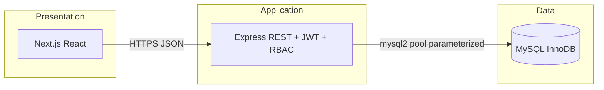

# System design — Digital Game Distribution Platform (GDPS)

Aligned with **SDD Final.pdf** (CS2011E, Group 5, March 2026).

## 1. Folder structure

```text
gdps-platform/
├── database/
│   ├── 00_init.sql          # optional: CREATE DATABASE only
│   ├── 01_schema.sql        # InnoDB schema, FKs, CHECK, indexes
│   ├── 02_seed.sql          # demo data (≥10 rows / core tables)
│   └── 03_demo_queries.sql  # joins & aggregations for reports
├── backend/                 # Tier 2 — Node.js (JavaScript) + Express + mysql2
│   └── src/
│       ├── app.ts
│       ├── routes/
│       ├── middleware/      # JWT + RBAC
│       └── db/
├── frontend/                # Tier 1 — Next.js (App Router, JavaScript) + Tailwind
│   └── src/app/             # pages: store, game, login, library, offers, admin, …
├── docker-compose.yml       # MySQL 8.4 + auto-init scripts
└── README.md
```

## 2. Three-tier architecture



- **Frontend** talks only to the API (`NEXT_PUBLIC_API_URL`). No direct DB access.
- **Backend** enforces authentication, roles, and wraps **purchase** in a **single DB transaction** (PURCHASE + PAYMENT + USER_LIBRARY).
- **Database** holds normalized tables (3NF per SDD §6.3) with constraints at the engine level.

## 3. API flow mapping (SDD §4)

| SDD flow | HTTP | Notes |
|----------|------|--------|
| Login (§4.1.1) | `POST /api/auth/login` | bcrypt verify → JWT |
| Register | `POST /api/auth/register` | Consumer role, cost factor 12 |
| Game search (§4.1.4) | `GET /api/games?q=&category=&minPrice=&maxPrice=` | Indexed title/price |
| Offers (§4.1.5) | `GET /api/offers` | Active window + join GAME |
| My games (§4.1.6) | `GET /api/purchase/library` | USER_LIBRARY ⟷ GAME |
| Purchase (§4.1.2) | `POST /api/purchase` | Transaction: inserts + library |
| Reviews (§4.1.3) | `GET/POST /api/reviews/...` | Ownership check via USER_LIBRARY |
| Admin analytics (§5.1) | `GET /api/admin/stats` | Revenue, users, top games |
| Developer portal (§5.1) | `GET /api/developer/stats` | Own `developer_id` only |

## 4. Core purchase logic (data layer)

1. **`purchases`** — one row per checkout; `price_paid` snapshot (includes active **OFFER** discount).
2. **`payments`** — 1:1 with purchase (`UNIQUE(purchase_id)`); `transaction_id` for audit.
3. **`user_library`** — ownership row created in the **same transaction** as payment success.

Rollback on any failure keeps the three tables consistent (ACID, SDD §5.2).

## 5. Security (SDD §5.3)

- bcrypt (rounds **12**), JWT secret from env, **parameterized** queries only.
- RBAC: `Admin` | `Developer` | `Consumer` on JWT + `requireRoles` middleware.
- Developers linked via `users.developer_id` → may only PATCH their games.

## 6. Database visualization mode

- Backend appends each executed SQL statement to an in-memory ring buffer (`/api/debug/activity`).
- Frontend **DB mode** panel polls every 1s, shows SQL + params + inferred tables, and **pulses** nodes on the relationship list when new writes occur.
